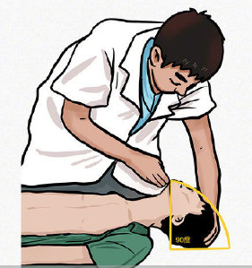
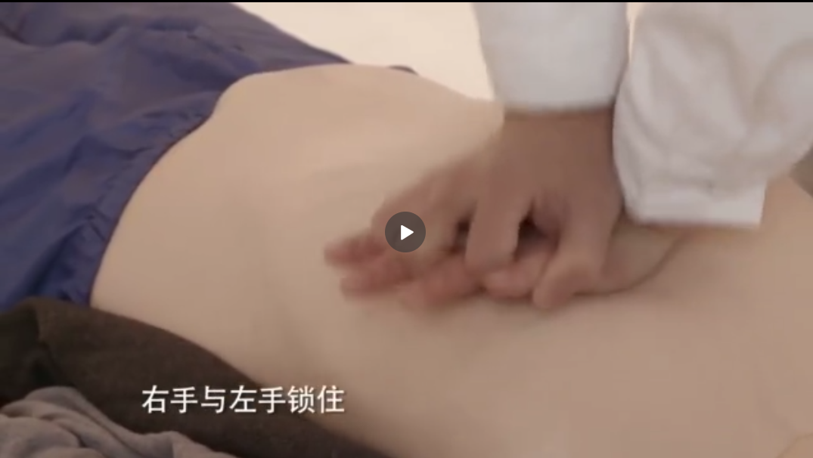
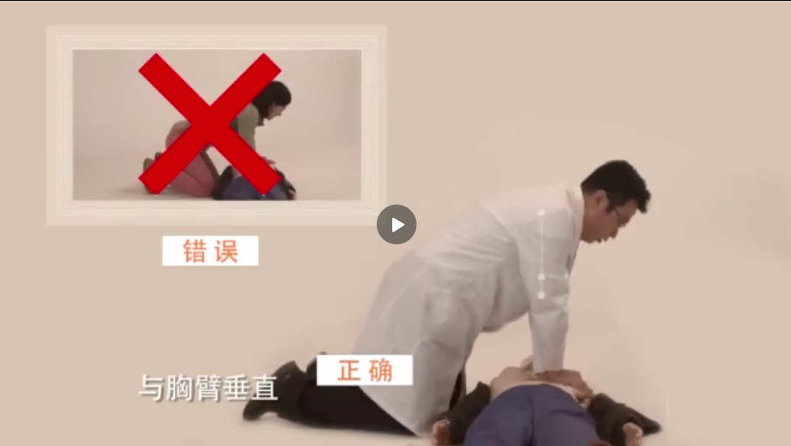
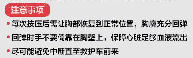
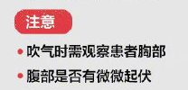

# 人心脏骤停或呼吸微弱怎么办？

[心肺复苏最详细的操作视频-哔哩哔哩_bilibili](https://www.bilibili.com/video/BV1Bt411t7gG?from=search&seid=14923416305920743900)

# 对于有呼吸的无意识者？

患者侧卧，头部后仰，清除口腔异物，保证气道通畅即可。

# 对于无呼吸的无意识者？

救助者：马上心肺复苏

周围人：安排120，取AED除颤器

## 救助者怎么做：

心肺复苏两步走：

胸外按压+人工呼吸    30:2的比例    循环往复，直至救护车来

### 0、前置步骤：

患者平躺，检查呼吸和颈动脉，清理口腔异物，仰头提下颌，开放气道。

操作示意：

### 1、胸外按压  每轮30次

暴露上胸，解开腰带，心脏按压的部位为两乳头的中间；手型：一手外展开，另一手锁住外展手。肩臂与胸臂垂直；按压频率为每分钟100-120次（大概1秒钟两次），深度为五到六厘米，在胸部完全回弹后再进行下一次按压，按压过程中不能中断，边按压，边数数，控制按压的速率。完成30次后，进行人工呼吸。

操作示意：

注意事项：

### 2、人工呼吸  吹两次

用毛巾或纱布盖住病人的嘴，捏住患者鼻子，用嘴包住患者的嘴，快速将气体吹入2次，每次1-1.5秒。

 

循环以上两步骤，以30:2的比例进行。直至救护车赶到。

